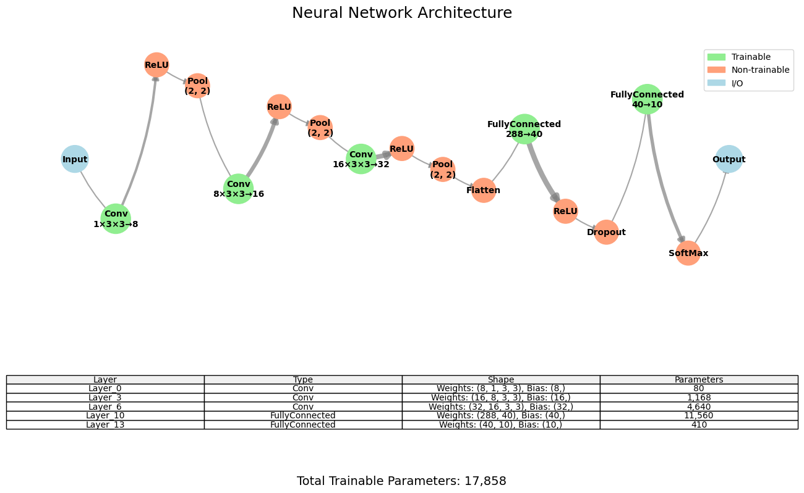
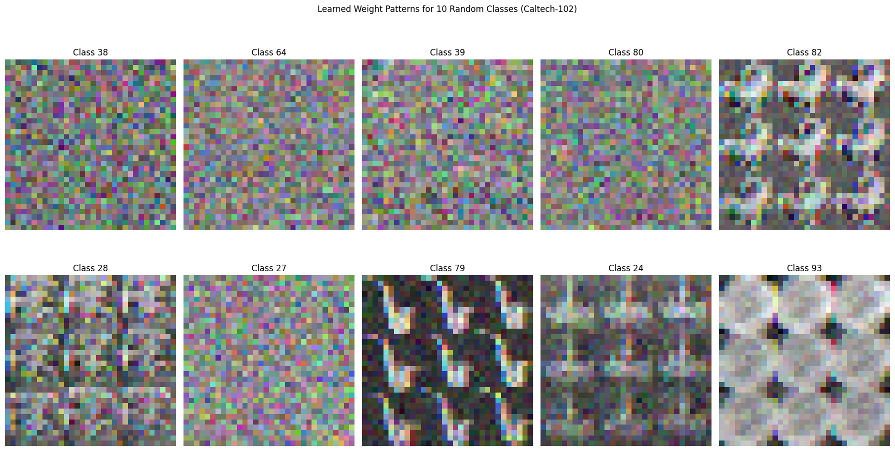

# ModularyNN - Neural Network Framework from Scratch

## Overview

ModularyNN is a complete neural network framework implemented entirely from scratch in Python without using deep learning libraries like TensorFlow or PyTorch. It provides deep understanding of neural network internals and includes all fundamental components: layers, activation functions, optimizers, and data management utilities.

The framework supports both **classification** and **regression** tasks with architectures ranging from simple multilayer perceptrons to complex convolutional and recurrent networks.

## Key Features

- ✅ **Complete from-scratch implementation** - No external deep learning dependencies
- ✅ **Multi-task support** - Classification and regression with automatic detection
- ✅ **Diverse architectures** - MLPs, CNNs, RNNs, LSTMs, and custom layers
- ✅ **Advanced optimization** - SGD, Momentum, Adam with L1/L2 regularization
- ✅ **Interactive visualization** - Network architecture plots and real-time training monitoring
- ✅ **Built-in datasets** - MNIST, CIFAR-10, Caltech101, Iris, and regression datasets
- ✅ **Comprehensive testing** - Gradient check validation and unit tests

## Dependencies

- **Core**: `numpy`, `scipy`, `matplotlib`, `networkx`, `scikit-learn`, `PIL`
- **Optional**: `pickle`, `gzip`, `tarfile` (for data handling)

## Project Structure

```
modularyNN/
├── Helpers/                          # Core framework and utilities
│   ├── NeuralNetwork.py              # Main neural network class
│   ├── trainNN.py                    # Training loop with metrics
│   ├── plottingNN.py                 # Architecture visualization
│   └── Helpers.py                    # Utility functions (gradient check, metrics)
│
├── Layers/                           # Layer implementations
│   ├── FullyConnected.py             # Dense layers
│   ├── Conv.py, Pooling.py           # Convolutional and pooling layers
│   ├── Activations.py                # All activation functions (ReLU, Sigmoid, SoftMax, etc.)
│   ├── Dropout.py, BatchNormalization.py  # Regularization layers
│   ├── RNN.py, LSTM.py               # Recurrent layers
│   ├── KNNLayer.py, RandomForestLayer.py  # ML hybrid layers
│   └── Initializers.py               # Weight initialization strategies
│
├── Optimization/                     # Optimizers and loss functions
│   ├── Optimizers.py                 # SGD, Adam, Momentum
│   ├── Loss.py                       # Loss functions with regularization
│   └── Constraints.py                # Weight constraints (L1, L2)
│
├── Data/datasets/                    # Dataset implementations
│   ├── MNISTData.py                  # MNIST (60k train, 10k test)
│   ├── CifarData.py                  # CIFAR-10 (50k train, 10k test)
│   ├── WaitPark.py                   # Regression dataset (38k samples)
│   └── RandomData.py                 # Random data generator
│
└── Models/                           # Example implementations
    ├── Classics/                     # linear, kNN, SVM, FC, CNN...
    ├── LeNet.ipynb                   # LeNet-5 CNN architecture
    └── waitParkRegression.ipynb      # Regression examples
```

## Quick Start Examples

### MNIST Classification

```python
from Helpers.NeuralNetwork import NeuralNetwork
from Layers.FullyConnected import FullyConnected
from Layers.Activations import ReLU, SoftMax
from Layers.Dropout import Dropout
from Layers.Initializers import He
from Optimization.Optimizers import Adam
from Data.datasets.MNISTData import MNISTData

# Load dataset and create network
mnist = MNISTData(batch_size=32, val_ratio=0.15)
net = NeuralNetwork(optimizer=Adam(0.001), weights_initializer=He(), bias_initializer=None)

# Build architecture
net.append_layer(FullyConnected(784, 256))
net.append_layer(ReLU())
net.append_layer(Dropout(0.2))
net.append_layer(FullyConnected(256, 10))

# Configure and train
net.data_layer = mnist
net.loss_layer = SoftMax()
history = net.train(iterations=1000, metrics_interval=50)

# Visualize and test
net.plot(title="MNIST Classifier")
predictions = net.test(mnist.get_test_set()[0][:100])
```

### CNN for CIFAR-10

```python
from Layers.Conv import Conv
from Layers.Pooling import Pooling
from Layers.Flatten import Flatten
from Data.datasets.CifarData import CifarData

cifar = CifarData(batch_size=32, val_ratio=0.15)
cnn = NeuralNetwork(optimizer=Adam(0.001), weights_initializer=He(), bias_initializer=None)

# CNN architecture
cnn.append_layer(Conv(stride_shape=(1, 1), convolution_shape=(5, 5), num_kernels=32))
cnn.append_layer(ReLU())
cnn.append_layer(Pooling(stride_shape=(2, 2), pooling_shape=(2, 2)))
cnn.append_layer(Flatten())
cnn.append_layer(FullyConnected(800, 10))  # Adjust size based on input

cnn.data_layer = cifar
cnn.loss_layer = SoftMax()
history = cnn.train(iterations=500)
```

### Regression Example

```python
from Data.datasets.WaitPark import WaitPark
from Optimization.Loss import L2Loss
from Layers.Activations import get_activation

dataset = WaitPark(batch_size=32, include_weather=True, val_ratio=0.15)
reg_net = NeuralNetwork(optimizer=Adam(0.001), weights_initializer=He(), bias_initializer=None)

# Get input size and build regression network
input_size = dataset._input_tensor.shape[1]
reg_net.append_layer(FullyConnected(input_size, 128))
reg_net.append_layer(get_activation('swish'))
reg_net.append_layer(FullyConnected(128, 1))  # Single output for regression

reg_net.data_layer = dataset
reg_net.loss_layer = L2Loss()
history = reg_net.train(iterations=800)
```

## Core Components

### Layer Interface
All layers inherit from `BaseLayer` and implement:
- `forward(input_tensor)`: Forward propagation
- `backward(error_tensor)`: Backward propagation with optional weight updates
- `trainable`: Boolean indicating if the layer has trainable parameters

### Available Layers
- **Dense**: FullyConnected with configurable units
- **Convolutional**: Conv for 1D/2D with stride and kernel configuration
- **Activation**: ReLU, LeakyReLU, ELU, Sigmoid, TanH, SoftMax, Swish, GELU
- **Regularization**: Dropout, BatchNormalization
- **Recurrent**: RNN, LSTM with gate mechanisms
- **Utility**: Flatten for shape conversion, KNN, RandomForest layers

### Optimizers & Features
- **Optimizers**: SGD, SGD+Momentum, Adam with L1/L2 regularization
- **Auto-detection**: Automatic classification vs regression task detection
- **Visualization**: Interactive architecture plots and real-time training monitoring
- **Dataset Management**: Standard train/validation/test splits (65%/15%/20%) with configurable ratios

## Testing & Validation

### Gradient Check
Validates layer implementations by comparing analytical gradients with numerical gradients:

```python
from Helpers.Helpers import gradient_check

layer = FullyConnected(10, 5)
layer.initialize(He(), None)
gradient_check(layer, np.random.random((3, 10)))
```

## Visualization Examples

### Network Architecture Visualization
The framework provides detailed architecture visualization for understanding network structure:


*Example of CNN architecture plot showing layers, connections, and parameter counts*

### Parameter Visualization
For networks with few parameters, the framework can visualize learned weights:


*Example of learned weight visualization for a linear classifier on Caltech dataset*

## Usage Notes
- Networks with <200 parameters show detailed parameter visualization
- Training automatically computes validation metrics when available
- All datasets use standard splits with configurable validation ratios
- Use `gradient_check` to validate custom layer implementations